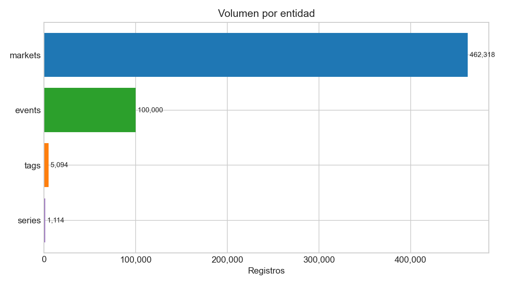
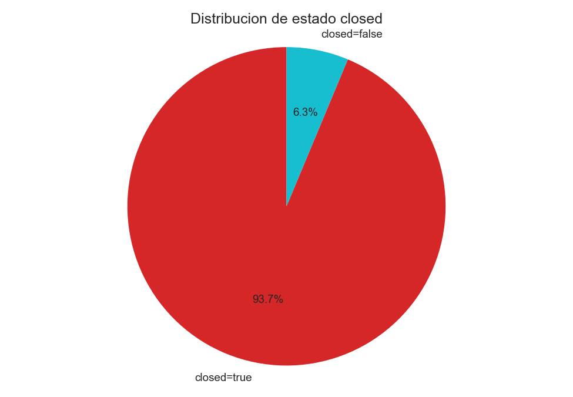
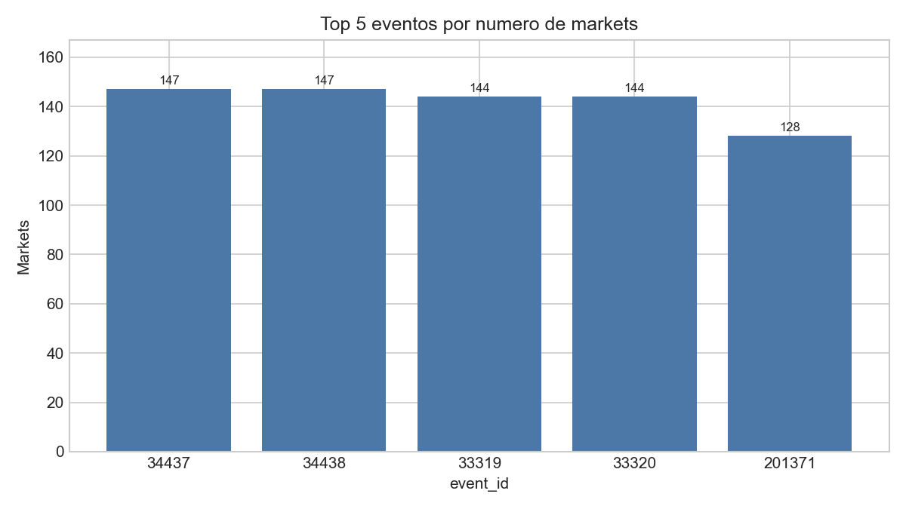
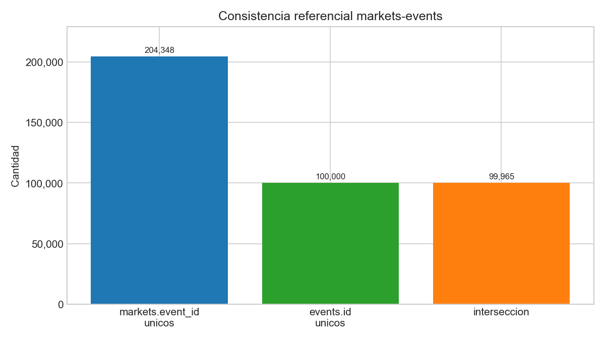

# Reporte de Volumetria (Actualizado)

- Fecha de generacion: 2026-03-09
- Fuente real: tablas Delta locales `polymarket/bronze/{markets,events,tags,series}`
- Ventana de ingesta en `markets._ingestion_ts`: `2026-02-18 16:51:02 UTC` a `2026-02-18 17:41:44 UTC`

## 1) Resumen rapido

- Total de registros analizados: **568,526**
- La entidad con mayor volumen es `markets` (**462,318** filas, 81.3% del total)
- `active = true` en el 100% de snapshots, pero `closed = true` en 93.7%
- Relacion principal: **204,348** eventos distintos referenciados por markets

## 2) Volumen por entidad

| Entidad | Registros |
|---|---:|
| markets | 462,318 |
| events | 100,000 |
| tags | 5,094 |
| series | 1,114 |

Grafico:

## 3) Estado de markets

| Metrica | True | False | % True |
|---|---:|---:|---:|
| active | 462,318 | 0 | 100.0% |
| closed | 433,198 | 29,120 | 93.7% |

Grafico:

## 4) Relacion markets -> events

- Eventos con al menos 1 market: **204,348**
- Promedio de markets por evento: **2.26**
- Mediana de markets por evento: **1**
- Maximo de markets en un evento: **147**

Top 5 eventos por numero de markets:

| event_id | markets |
|---|---:|
| 34437 | 147 |
| 34438 | 147 |
| 33319 | 144 |
| 33320 | 144 |
| 201371 | 128 |

Grafico:

## 5) Consistencia referencial

- `event_id` distintos en markets: **204,348**
- `id` distintos en events: **100,000**
- Interseccion (`markets.event_id` vs `events.id`): **99,965**

Grafico:

Conclusion: la cobertura de relacion `markets -> events` es alta sobre el universo de `events` cargado.
